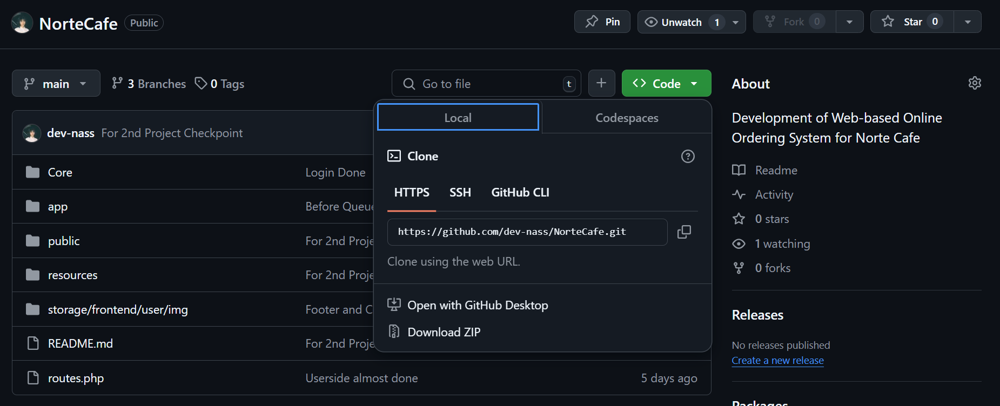
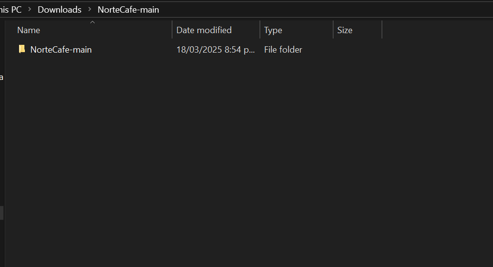
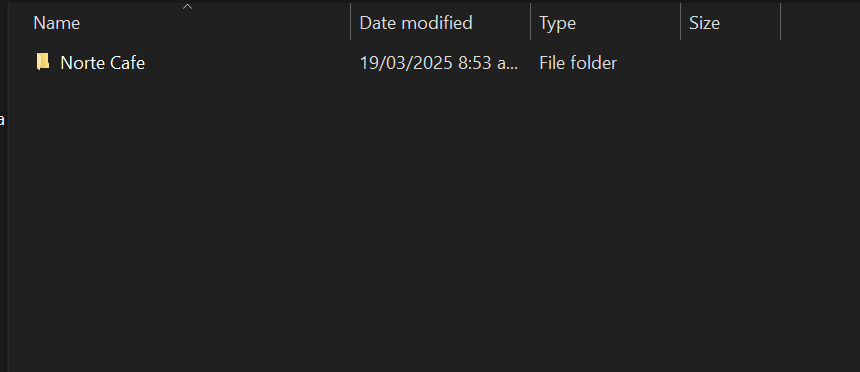
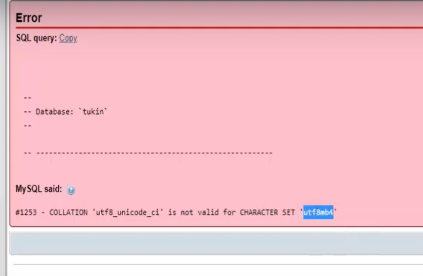

# Setting Everything Up
### Front-End
- First install the `ZIP` file of the codebase; Click `Code` button at the upper right corner of the screen and download zip.

- Locate the downloaded ZIP file and extract it. The extracted file contain a folder named. 
- Rename it to 
- Head to this directory `xampp/htdocs/`. Create a new folder there named `PHP 2025` and paste there the whole `Norte Cafe` folder you extracted and named earlier.
- Access the website using this URL 
```
http://localhost/PHP%202025/Norte%20Cafe/public/index.php/index
```

### Back-End
- Download the `.sql` file that contains the whole configuration of the database to discord.
- Create a new database named `norte_cafe` within phpMyAdmin.
- Try importing the downloaded `.sql` file; (1) it shows success then your good to go, (2) but if it fails, copy the error code, and 
- open the `.sql` file with vscode/notepad or any of your desired text editor, find every instance/copy of the error code within the file and replace every single one of them with `utf8mb4_general_ci`.
- After all that is done, reset the database (drop every `table`, if there's any, and drop all the stored `procedures`);
- Then do it again, try importing the edited `.sql` file.

# Class Autoload Functionality
- We are using this
```php
spl_autoload_register(function ($class) {
    // used due to namespace class, at controllers
    // DIRECTORY_SEPERATOR can be substituted with '/', 
    // but using this is more dynamic & will automatically design what's appropriate to your OS
    $class = str_replace('\\', DIRECTORY_SEPARATOR, $class);
    require base_path("{$class}.php");
});
```
- Instead of manually adding each of these
```php
require base_path("Core/Router.php");
require base_path("App/Http/Controllers/UserController.php");
```

# Understanding Routes Logic
### Full OOP Approach
- With this approach the controllers are now enclosed within their own classes.
```
navbar.php > public/index.php > routes.php >  Router.php > TestController.php
```
- Everytime we click an anchor tag, the code within the `public/index.php` is triggered.
The `Router.php` class then iterates to the registered routes given by `routes.php`, but this time it adds an additional functionality;
- Instead of getting the php file based on what's passed within the routes.php.
```php
// previous approach

// routes.php
$router->get('login', 'login/create.php');

// Router.php
public function route($uri, $method) {
    foreach($this->routes as $route) {
        if($route['uri'] === $uri && $route['method'] === strtoupper($method)) {
            return require base_path("app/Http/Controllers/" . $route['controller']);
        }
    }
}
```
- We are now receiving the controller class, and iterates to each of its method (index, create, store etc.,) and see what matches based on the controllerMethod passed on routes.php
```php
// current approach

// routes.php
$router->get('test', 'TestController', 'create');

// Router.php
public function route($uri, $method) {
    foreach($this->routes as $route) {
        if($route['uri'] === $uri && $route['method'] === strtoupper($method)) {
            // return require base_path("app/Http/Controllers/" . $route['controller']);
                
            /**
            * Will be getting the controller class from routes.php
            */
            $controllerClassName = 'app\Http\Controllers\\' . $route['controller_class'];
            $controllerInstance = new $controllerClassName();
            $controllerMethods = get_class_methods($controllerInstance);

            foreach($controllerMethods as $controller_method) {
                if($route['controller_method'] === $controller_method) {
                call_user_func([$controllerInstance, $controller_method]);
                }
            }
        }
    }
}
```

# Registration
- Validator

# Login
- Session
- Authenticator

# Pagination

# Filtering Logic
- Search Filter
- Category Filter
- How did Session got involve in this two process

# Middleware
- routes.php
- Router.php
- Middleware.php
- What's multidimensional array

- For testing my contributions